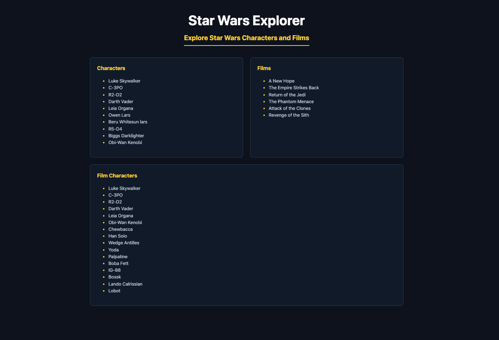

# Star Wars Explorer

A web app to browse Star Wars characters and films and navigate between them, using the SWAPI - swapi.tech API.



## Features

- Browse a list of Star Wars characters.
- Click a character to see the films they appear in.
- Click a film to see its characters.

## Tech Used

- Vanilla HTML, CSS, JavaScript — no framework, no build tool.
- Data from the swapi.tech API (keyless — no API key needed).

## How to Run

Follow these steps to run the application locally.

### 1. Clone the repository to your local machine
  
```bash
git clone https://github.com/iamntoko/api-explorer.git
```

Navigate into the project directory:

```bash
cd api-explorer
```

### 2. Start a Local HTTP Server

This application must be served through a local HTTP server.

Do not open `index.html` directly in your browser using `file://`.
The application uses JavaScript `fetch()` requests, which requires the page to be served over `http://`.

Choose one of the following methods:

#### Option 1: VS Code Live Server

1. Install the Live Server extension in VS Code.
2. Open the project folder in VS Code.
3. Right-click on `index.html`.
4. Select: `Open with Live Server`.
5. Your default browser will open automatically at a URL similar to:

```bash  
   http://127.0.0.1:5500/api-explorer/index.html
```

#### Option 2: Using `npx serve` - Node.js

- If you have Node.js installed, run: `npx serve` in your terminal.
- Open the URL provided in your browser, typically: `http://localhost:3000`.
  
```bash
Serving!

- Local:    http://localhost:3000
- Network:  http://<your-local-ip>:3000

Copied local address to clipboard!
```

#### Option 3: Using Python's Built-in HTTP Server

- If Python is installed, run: `python3 -m http.server` in your terminal.
- Click on the `http` link to open in your browser:
  
```bash
Serving HTTP on :: port 8000 (http://[::]:8000/) ...
```

### Notes

- No build step is required.
- No dependencies need to be installed.
- No API key is required.
- The application runs entirely in the browser using HTML, CSS, and JavaScript.
